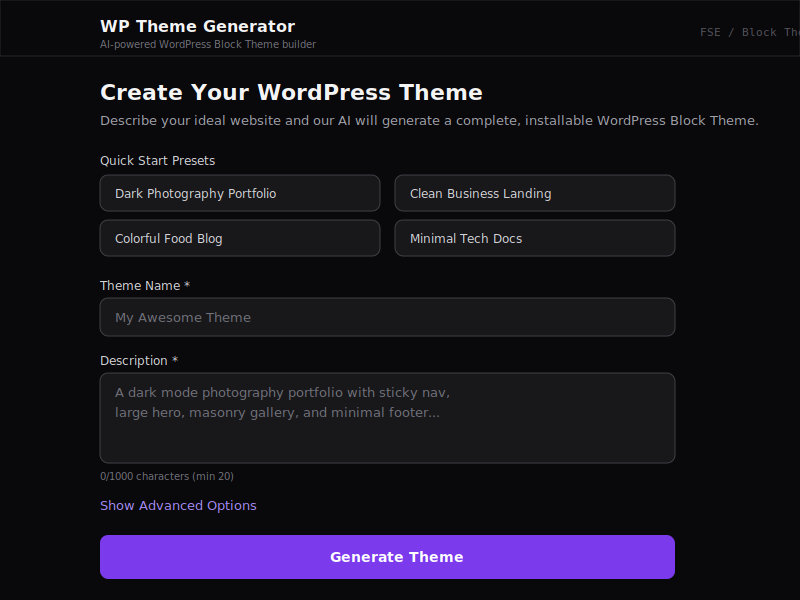
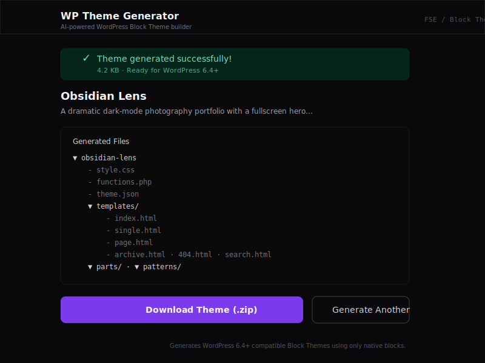

# Word-Press-O-Matic

AI-powered web application that generates complete, production-ready WordPress Block Themes from natural language descriptions.

## Quick Start

```bash
git clone <repo-url>
cd wp-theme-generator
npm install
```

Copy the example environment file and add your API key:

```bash
cp .env.example .env.local
```

Then edit `.env.local` and set your Anthropic API key:

```
ANTHROPIC_API_KEY=your-actual-api-key
```

Start the development server:

```bash
npm run dev
```

Open [http://localhost:3000](http://localhost:3000) in your browser.

## Architecture Overview

The system has 4 layers with unidirectional data flow:

```
[User Input] → [AI Orchestration] → [Theme Assembly] → [ZIP Package]
     ↓               ↓                     ↓                ↓
  Validated      Structured JSON      File contents      Downloadable
  form data      from Claude          as strings         .zip archive
```

**Layer 1 — Input Processing:** The frontend collects a theme description, optional colors, typography, and feature flags. Input is validated with Zod schemas on both client and server.

**Layer 2 — AI Orchestration:** A carefully engineered system prompt instructs Claude to return a single JSON object containing every file for the theme. The response is parsed, stripped of any markdown fences, and validated against strict Zod schemas. If validation fails, the system retries once with error context appended.

**Layer 3 — Theme Assembly:** The validated JSON is transformed into actual file contents — `theme.json`, HTML templates, PHP pattern files, `style.css` with WordPress header, and `functions.php`. Every template undergoes block markup validation to reject any `wp:html` usage.

**Layer 4 — Packaging:** All files are assembled into the correct WordPress theme directory structure and archived into a ZIP using the `archiver` library entirely in memory (no temp files).

## How Theme Generation Works

1. User fills out the form (or picks a preset) and clicks "Generate Theme"
2. The frontend POSTs to `/api/generate` with the theme request
3. The API route validates input, constructs system + user prompts, and calls Claude
4. Claude returns a JSON object with `themeJson`, `templates`, `templateParts`, `patterns`, and `styleCss`
5. The response is parsed, validated against Zod schemas (with one retry on failure)
6. All block markup is scanned — any `wp:html` block causes rejection
7. Files are assembled: `theme.json` gets the WordPress schema URL, patterns get PHP headers, etc.
8. Everything is packaged into a ZIP and streamed back to the browser
9. User downloads the `.zip` and installs it in WordPress 6.4+

## Tech Stack

| Technology | Purpose |
|---|---|
| Next.js 16 (App Router) | Full-stack framework with API routes |
| TypeScript (strict) | Type safety across the entire codebase |
| Tailwind CSS | Utility-first styling for the UI |
| Anthropic Claude API | AI model for theme generation |
| Zod | Runtime schema validation for input and AI output |
| archiver | In-memory ZIP file creation |
| Vitest | Unit and integration testing |

## Running Tests

```bash
npm test          # Run all tests once
npm run test:watch  # Run tests in watch mode
```

The test suite includes:
- **Block validator tests** — ensures `wp:html` rejection, balanced tags, JSON attribute parsing
- **Schema tests** — validates Zod schemas for requests and generated themes
- **Prompt tests** — verifies system/user prompt construction
- **Parser tests** — tests JSON parsing, code fence stripping, schema validation
- **Theme builder tests** — template filenames, pattern PHP headers, style.css format, functions.php
- **Packager tests** — ZIP integrity, file structure, correct paths
- **Integration test** — end-to-end pipeline from mock AI response to validated ZIP

## Environment Variables

| Variable | Description | Required |
|---|---|---|
| `ANTHROPIC_API_KEY` | Anthropic API key for Claude access | Yes |
| `AI_MODEL` | Claude model ID (default: `claude-sonnet-4-20250514`) | No |

## Screenshots

### Input Form
The main interface with quick-start presets, theme name/description fields, and collapsible advanced options (color palette, typography, features).



### Result & Download
After successful generation, the app displays a success banner, file tree of all generated theme files, and download/reset buttons.



## Known Limitations

- **AI output variability**: Claude occasionally produces block markup with minor structural issues (mismatched tags, incorrect attribute names). The validator catches most issues, but edge cases may slip through.
- **No live preview**: The generated theme cannot be previewed in-browser — it must be downloaded and installed in WordPress to see the result.
- **Single-shot generation**: If the AI output fails validation twice, the user gets an error. There's no iterative refinement.
- **Font loading**: The theme references Google Fonts by name in `theme.json` but doesn't bundle font files. WordPress handles this via its built-in webfont loader, but some hosting setups may need manual font configuration.
- **Image placeholders**: Cover blocks use overlay colors rather than actual images, since placeholder images may not persist.
- **No custom CSS isolation**: The `styleCss` field from the AI is appended directly to `style.css`. While it's validated for basic structure, there's no CSS scoping or sanitization beyond what WordPress provides.
